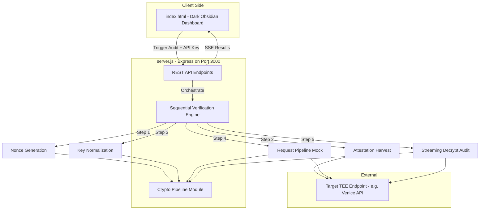
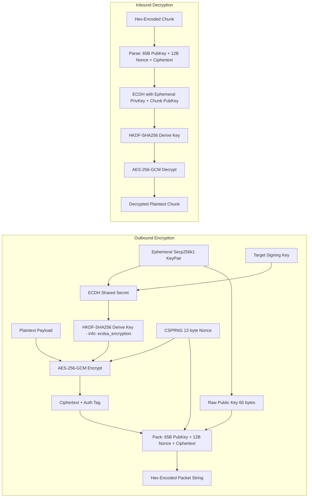
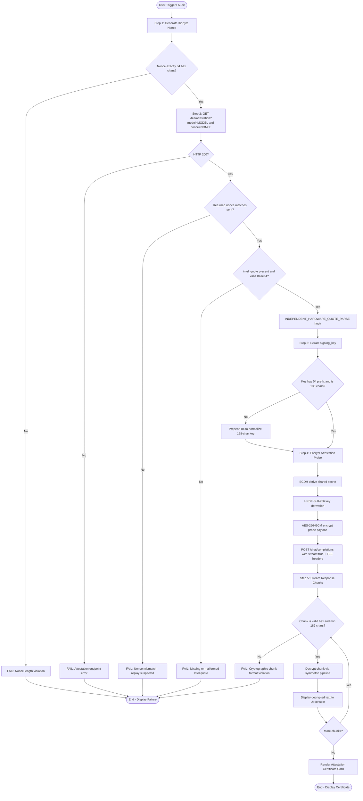

# Attestation Station — Implementation Plan

## Project Overview

Attestation Station is an open-source tool by Lake Boiler Labs that verifies and proxies requests to stateless, end-to-end encrypted LLM endpoints. It performs **independent cryptographic validation** of hardware attestation payloads rather than blindly trusting server-returned verification flags.

---

## Architecture Overview



---

## Cryptographic Pipeline Detail



---

## Sequential Verification Algorithm



---

## File Specifications

### 1. `package.json`

- **Dependencies:**
  - `express` — HTTP server framework
  - `elliptic` — Secp256k1 ECDH key generation and shared secret derivation
  - `@noble/ciphers` — AES-256-GCM encryption/decryption
  - `@noble/hashes` — HKDF-SHA256 key derivation
  - `node-fetch` — HTTP client for attestation harvest and chat completions (or native fetch if Node 18+)

- **Scripts:**
  - `start`: `node server.js`

### 2. `server.js`

#### Module Structure (all in one file, logically organized):

**2a. Crypto Utilities Section**

| Function | Purpose |
|----------|---------|
| `generateEphemeralKeyPair` | Creates a new secp256k1 ECDH keypair using elliptic library |
| `deriveSharedSecret` | Computes ECDH shared secret from local private key and remote public key |
| `deriveSymmetricKey` | Runs HKDF-SHA256 with info string `ecdsa_encryption`, no salt |
| `encryptPayload` | AES-256-GCM encrypt with random 12-byte nonce; packs into hex string: 65B pubkey + 12B nonce + ciphertext |
| `decryptPayload` | Parses hex packet, extracts ephemeral pubkey + nonce + ciphertext; decrypts with AES-256-GCM |
| `generateNonce` | Generates 32 bytes via CSPRNG, returns 64-character hex string; rejects if target requires different length |
| `validateHexString` | Checks minimum 186 hex chars, even length, valid hex characters |

**2b. INDEPENDENT_HARDWARE_QUOTE_PARSE Section**

This is a clearly labeled code block hook that:
- Decodes the Base64 `intel_quote` field into raw bytes
- Extracts the quote header structure (TDQUOTE structure fields)
- Inspects the `TEE_TYPE` field to confirm it is TDX (value 0x81)
- Reads the `REPORT_DATA` field to verify it contains the expected nonce hash
- Checks debug-mode bits in the `ATTRIBUTES` field and flags if set
- Logs all findings independently — does NOT simply return the server `verified` boolean
- Provides a structured result object: `{ teeType, debugMode, reportDataMatch, quoteVersion, rawBytesLength }`

**2c. Attestation Harvest Handler**

- Accepts POST `/api/attest` with body: `{ targetUrl, model, apiKey }`
- Executes Step 1 (nonce generation) and Step 2 (attestation harvest)
- Returns structured JSON with validation results per field

**2d. Full Verification Orchestration Handler**

- Accepts POST `/api/verify` with body: `{ targetUrl, model, apiKey }`
- Executes all 5 steps sequentially
- Streams results back via Server-Sent Events (SSE) so the UI can update in real-time
- Each step emits a status event: `{ step, status, data }`

**2e. Static File Serving**

- Serves `index.html` from the project root on GET `/`

### 3. `index.html`

#### Layout Structure:

```
+--------------------------------------------------+
|  HEADER: Attestation Station by Lake Boiler Labs |
+--------------------------------------------------+
|  INPUT PANEL                                      |
|  [Target URL]  [Model ID]  [API Key]             |
|  [RUN AUDIT button]                               |
+--------------------------------------------------+
|  CONSOLE READOUT PANEL                            |
|  Step 1: Nonce Generation ........... PASS        |
|  Step 2: Attestation Harvest ....... PASS         |
|    -> intel_quote: Base64 validated               |
|    -> INDEPENDENT_QUOTE_PARSE: TDX confirmed      |
|  Step 3: Key Normalization ........ PASS           |
|  Step 4: Request Pipeline Mock .... PASS          |
|  Step 5: Streaming Decrypt ........ PASS           |
|    > Decrypted text appears here in real-time     |
+--------------------------------------------------+
|  CERTIFICATE CARD (shown on success)              |
|  +--------------------------------------------+   |
|  | ATTESTATION CERTIFICATE                    |   |
|  | Model: ...                                 |   |
|  | TEE Provider: ...                          |   |
|  | Signing Key: ...                            |   |
|  | Signing Address: ...                        |   |
|  | Nonce: ...                                  |   |
|  | Intel Quote: Validated                      |   |
|  | Debug Mode: No                              |   |
|  | Timestamp: ...                              |   |
|  |                                            |   |
|  | Lake Boiler Labs - 2026                    |   |
|  +--------------------------------------------+   |
+--------------------------------------------------+
```

#### Color Scheme:

| Element | Color | Hex |
|---------|-------|-----|
| Background | Deep Obsidian | #0a0a0a |
| Primary Text | Stark White | #e8e8e8 |
| Monospace Text | Light Gray | #c0c0c0 |
| Passing/Verified | Vivid Emerald | #00c853 |
| Warning/Operational | Bright Amber | #ffc107 |
| Critical Failure | Crimson | #d50000 |
| Card Border | Emerald | #00c853 |
| Input Background | Dark Gray | #1a1a1a |

#### Key UI Behaviors:
- SSE connection to `/api/verify` for real-time step updates
- Each console line colored by status (emerald=pass, amber=warning, crimson=fail)
- Certificate Card animates in from bottom on full success
- All text in monospace font family

### 4. `start_attestation.bat`

```bat
@echo off
echo Attestation Station - Lake Boiler Labs
echo.

where node >nul 2>&1
if %errorlevel% neq 0 (
    echo ERROR: Node.js is not installed or not in PATH.
    echo Please install Node.js from https://nodejs.org
    pause
    exit /b 1
)

echo Node.js found:
node --version

echo Installing dependencies...
call npm install

echo Starting Attestation Station on port 3000...
start "" http://localhost:3000
node server.js
```

---

## API Endpoint Summary

| Method | Path | Purpose |
|--------|------|---------|
| GET | `/` | Serve index.html |
| POST | `/api/verify` | Full 5-step verification with SSE streaming |
| POST | `/api/attest` | Steps 1-2 only: nonce + attestation harvest |

### POST `/api/verify` Request Body

```json
{
  "targetUrl": "https://api.venice.ai",
  "model": "llama-3.3-70b",
  "apiKey": "vp_..."
}
```

### SSE Event Format

```
event: step
data: {"step":1,"name":"nonce_generation","status":"pass","data":{"nonce":"..."}}

event: step
data: {"step":2,"name":"attestation_harvest","status":"pass","data":{"verified":true,"intel_quote":"..."}}

event: step
data: {"step":3,"name":"key_normalization","status":"pass","data":{"signing_key":"04...","normalized":true}}

event: step
data: {"step":4,"name":"request_pipeline","status":"pass","data":{"encrypted":true}}

event: step
data: {"step":5,"name":"streaming_decrypt","status":"pass","data":{"plaintext":"Attestation Probe"}}

event: complete
data: {"success":true,"certificate":{...}}

event: error
data: {"step":2,"message":"Nonce mismatch"}
```

---

## Cryptographic Constants Reference

| Constant | Value |
|----------|-------|
| Curve | secp256k1 |
| HKDF Hash | SHA-256 |
| HKDF Info | `ecdsa_encryption` (UTF-8 bytes) |
| HKDF Salt | None / undefined |
| AES Mode | 256-bit GCM |
| Nonce Length | 12 bytes (cryptographically random) |
| Ephemeral Public Key | 65 bytes uncompressed (04 prefix) |
| Minimum Packet Hex Length | 186 characters |
| Client Nonce | 32 bytes = 64 hex characters |
| Uncompressed Key Length | 130 hex characters |
| Bare Key Length | 128 hex characters (needs 04 prepend) |

---

## Dependency Justification

| Package | Reason |
|---------|--------|
| `express` | Industry-standard HTTP server with SSE support |
| `elliptic` | Mature secp256k1 implementation for ECDH key agreement |
| `@noble/ciphers` | Modern, audited AES-256-GCM implementation |
| `@noble/hashes` | Modern, audited HKDF-SHA256 implementation |

No proprietary or closed-source dependencies. All are permissively licensed.

---

## Security Considerations

1. The client ephemeral keypair is generated fresh per verification session — never reused.
2. The 32-byte nonce ensures freshness and binds the attestation to this specific session.
3. The `INDEPENDENT_HARDWARE_QUOTE_PARSE` hook provides structural audit of the raw TDX quote, checking for debug-mode bits and validating hardware root keys rather than trusting the server `verified` boolean.
4. API keys are never logged or stored — passed directly to the target endpoint.
5. The symmetric key is derived via HKDF with a fixed info string, ensuring domain separation.
6. All cryptographic operations use CSPRNG for nonce generation.